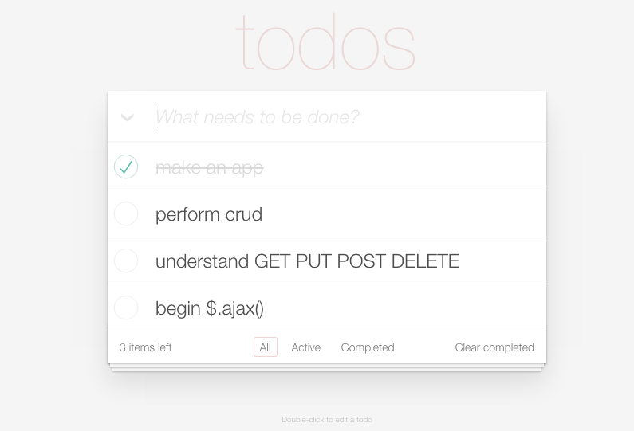

# Todo App recreation with crud

## Description
Create a todo application that performs CRUD.

## Objectives

* To understand Create/Read/Update/Delete
* Get a firm handle on underscore templating
* Begin to understand $.ajax() `GET`, `PUT`, `POST`, `DELETE`

### Learning Objectives

After completing this assignment, you should…

* Understand ...

### Performance Objectives

After completing this assignment, you be able to effectively use

* Use ...

## Details

### Deliverables

* A repo containing at least:
  * `bower.json`
  * `main.js`
  * `index.html`

### Requirements

* A faithful rendition of the todo app image
* The application must CREATE, READ, UPDATE, and DELETE
* User must have ability to see the number of completed todos are left
* User must have ability to view only completed, active, and all todos
* User must be able to 'complete' a todo without deleting
* User must be able to delete all 'completed' todos in bulk, with one action on the page

## Normal Mode

Recreate the todo app shown above with the functionality mentioned in the requirements.

## Hard Mode

Have the ability to store and save different lists of todos..

## Resources (literally)

You will need to use the following server to perform your ajax requests:

[http://tiy-fee-rest.herokuapp.com/collections/\<yourCollection\>](http://tiy-fee-rest.herokuapp.com/collections/tacobell)

** If you feel like the server is down, please ping me on slack and I'll take a look.
